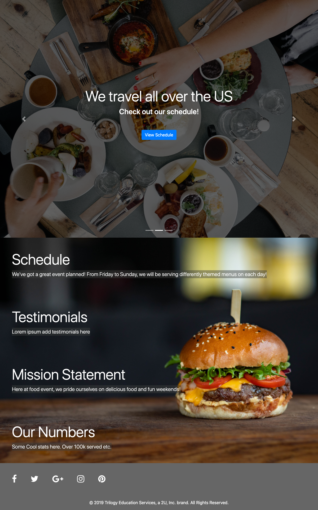
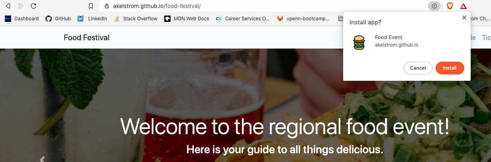

# Food Festival

## Description

This is an app called Food Festival. The client was looking for help with two main blockers. A fast and performant application, especially on mobile, because the app is designed for event attendees who will be using it on their phones. And to transform the app into a PWA. 

I used Google's Lighthouse web auditing tool to investigate metrics and performance issues with the app, and implemented a few strategies to make improvements. For example, I used Webpack to make the production code more efficient, and also used it to automatically minify the JavaScript files and images.

The client also want to turn the app into a PWA, or Progressive Web Application. For the Food Festival app, this means that event attendees would be able to access data such as schedules and vendor locations without worrying about having a cell signal or WiFi. 

## Usage 
Feel free to visit/install Food Festival [here](https://akelstrom.github.io/food-festival/).

Here is what the home page looks like after installation:

## Installation
To install the application, navigate to [this](https://akelstrom.github.io/food-festival/) page and click the `+` button, and then click `install`. Refer to the image below for a visual representation:

.

## Build With
* Webpack
* JavaScript
* Google Lighthouse Audit
* PWA
* Github Pages (deployment)

## Credits
Big thanks to the Upenn LPS Coding Bootcamp Instructional staff, and my tutor for all the support.

## Questions

If you have any questions, feel free to email me at [akelstrom@gmail.com](mailto:akelstrom@gmail.com).
